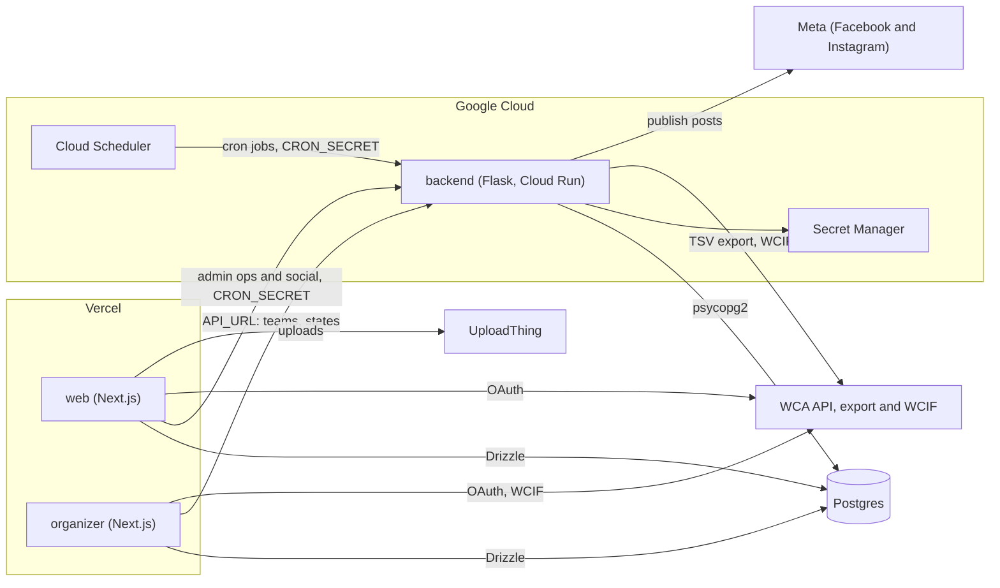

# Architecture

How the apps in this monorepo fit together, and which one owns each kind of work. When adding a feature, check here first so logic ends up in the right place.

## Who owns what

**`@workspace/db`** ([packages/db](../packages/db))

- Single source of truth for the Postgres schema (Drizzle), migrations, and seed data.
- The Flask backend reads and writes the same tables with raw SQL. Any schema change goes through a Drizzle migration first.

**backend (Flask)** ([apps/backend](../apps/backend))

- WCA TSV export import (`/update-database`) and the full nightly pipeline (`/update-all`).
- Bulk recomputation across all states: state ranks, state records, Kinch, sum of ranks, streaks, nemesis stats, and competition round dates (WCIF).
- Social posts: image rendering (PIL), captions, and publishing to Facebook and Instagram.
- Every mutating endpoint is protected by `require_cron_auth` (bearer `CRON_SECRET`). Cloud Scheduler calls them, and so does the web superadmin panel through `BACKEND_URL`.
- A small read API (`/teams`, `/states`, `/persons`, `/rank/...`) that the organizer app uses.

**web (Next.js)** ([apps/web](../apps/web))

- The public site: rankings, records, persons, teams, competitions, summaries, and comparisons. Reads go straight to Postgres via Drizzle with Cache Components.
- Auth via `@workspace/auth` (Better Auth + WCA OAuth), shared with the organizer app.
- Team management and superadmin server actions.
- Incremental, single-state updates when a team edits its roster: [`lib/update-state-ranks.ts`](../apps/web/lib/update-state-ranks.ts), [`lib/update-state-records.ts`](../apps/web/lib/update-state-records.ts), and `/api/update-state-ranks` / `/api/update-state-records`.
- Superadmin "ops" and social pages that proxy to the Flask backend instead of reimplementing jobs.

**organizer (Next.js)** ([apps/organizer](../apps/organizer))

- Printables (certificates, badges, scorecards), the competition desk, and groups. See [organizacion-roadmap.md](./organizacion-roadmap.md).
- Reads WCIF from the WCA, its own designs from Postgres, and teams and states from the Flask backend.

## Known duplication

State ranks and state records are computed in two places:

- **Python:** [`routes/admin/state.py`](../apps/backend/routes/admin/state.py) and `update_all.py`, for all states after each WCA import.
- **TypeScript:** `apps/web/lib/update-state-ranks.ts` and `update-state-records.ts`, for one state after roster changes.

Both must apply the same rules: tie handling, excluded events, the 9i2 effective date, and the marker hierarchy described in [state-records.md](./state-records.md). When you change ranking or record logic, update both implementations.

## Related docs

- [state-records.md](./state-records.md): how state records are determined
- [web-hosting-constraints.md](./web-hosting-constraints.md): Vercel free-tier limits that shape `apps/web`
- [Backend README](../apps/backend/README.md): endpoints, cron jobs, and social posts
